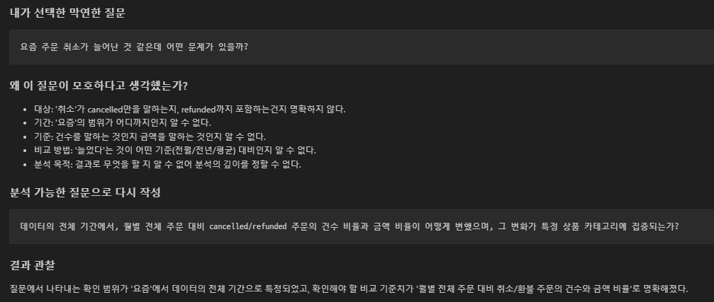
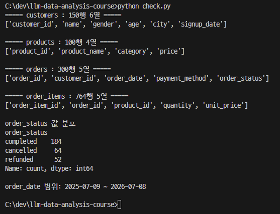
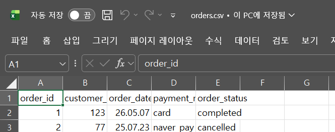
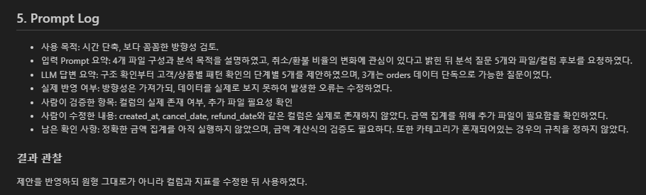

# Chapter 01 제출 답안. AI와 함께하는 데이터 분석의 시작

> 이 파일은 Chapter 01 실습 결과를 정리하여 제출하기 위한 학생용 템플릿입니다.  
> 강사 저장소의 원본 템플릿을 직접 수정하지 말고, 자신의 PC에 복사한 뒤 작성합니다.

---

## 0. 제출 정보

- 이름: 배성윤
- GitHub ID: aeuyui
- 개인 저장소명: `llm-data-analysis-study`
- 작성일: 2026-09-08
- 사용한 LLM: ChatGPT

### 최종 제출 URL

```text
https://github.com/aeuyui/llm-data-analysis-study
```

---

## 1. 원래 업무 질문

### 내가 선택한 막연한 질문

```text
요즘 주문 취소가 늘어난 것 같은데 어떤 문제가 있을까?
```

### 왜 이 질문이 모호하다고 생각했는가?

- 대상: '취소'가 cancelled만을 말하는지, refunded까지 포함하는건지 명확하지 않다.
- 기간: '요즘'의 범위가 어디까지인지 알 수 없다.
- 기준: 건수를 말하는 것인지 금액을 말하는 것인지 알 수 없다.
- 비교 방법: '늘었다'는 것이 어떤 기준(전월/전년/평균) 대비인지 알 수 없다.
- 분석 목적: 결과로 무엇을 할 지 알 수 없어 분석의 깊이를 정할 수 없다.

### 분석 가능한 질문으로 다시 작성

```text
데이터의 전체 기간에서, 월별 전체 주문 대비 cancelled/refunded 주문의 건수 비율과 금액 비율이 어떻게 변했으며, 그 변화가 특정 상품 카테고리에 집중되는가?
```

### 결과 관찰

```text
질문에서 나타내는 확인 범위가 '요즘'에서 데이터의 전체 기간으로 특정되었고, 확인해야 할 비교 기준치가 '월별 전체 주문 대비 취소/환불 주문의 건수와 금액 비율'로 명확해졌다. 
```

### 나의 해석과 판단

order_status에 cancelled와 refunded가 함께 존재하는 것을 보고, 두 상태를 하나로 합쳐서 볼지 나눠서 볼지 결정해야 했다. 인터넷 주문의 경우 취소는 단순 변심일 수 있으나 환불은 고객이 상품을 수령한 이후 발생하는 것이기 때문에, 환불 건수가 많을 수록 해당 상품을 점검해야할 필요성이 커진다고 생각했다. 다만 이는 데이터로 확인한 사실이 아니라 일반적인 이커머스 상식에 기댄 가정이므로, 두 상태를 합산한 지표와 분리한 지표를 모두 확인하기로 했다.
(1) (cancelled 건수 + refunded 건수)/전체 주문 건수
(2) 취소율 = cancelled 건수 / 전체 주문 건수
(3) 환불율 refudned 건수 / 전체 주문 건수 

### 업무·분석적 의미

취소/환불 건이 특정 상품 카테고리에 집중되어있음이 확인되면 해당 상품들의 검수나 상세페이지를 우선적으로 점검할 근거가 된다.

### 한계와 추가 확인 사항

취소 사유를 데이터에서 알 수 없으며 데이터 수집 기간이 1년으로 한정되어있어 계절성과 추세를 구분할 수 없다.

### Evidence



---

## 2. 질문과 필요한 데이터 연결

### 필요한 데이터 파일

- [ ] `customers.csv`
- [O] `products.csv`
- [O] `orders.csv`
- [O] `order_items.csv`

### 필요한 컬럼 후보

| 파일 | 필요한 컬럼 | 필요한 이유 |
| --- | --- | --- |
| orders | order_id | 주문 건수를 세는 단위 |
| orders | order_date | 월별 집계 기준 |
| orders | order_status | 취소·환불 구분 |
| order_items | order_id | 주문과 상세를 연결 |
| order_items | quantity, unit_price | 주문 금액 계산 |
| order_items | product_id | 상품과 연결 |
| products | product_id, category | 카테고리별 집계 |

### 데이터 연결 관계

```text
orders.order_id  ->  order_items.order_id     (1:N)
order_items.product_id  ->  products.product_id  (N:1)
```

### 결과 관찰

네 파일을 확인해본 결과 orders는 300행, order_items는 764행, customers는 150행, products는 100행이 있었다.
order_status 값은 completed 184개, cancelled 64개, refunded 52개가 있었다.
custmers 데이터에는 고객에 대한 상세 정보가 적혀있어 질문과는 관계 없는 데이터라고 판단하였다.

### 나의 해석과 판단

현재 데이터로 질문에 답할 수는 있으나, 추가적인 금액 계산 등이 필요할 것으로 보인다.

### 업무·분석적 의미

컬럼을 확인하지 않고 코드부터 짰다면 데이터가 order_id와 같은 컬럼으로 연결되어 있음을 확인하지 못하여 데이터 파일 간의 유기적인 관계를 파악할 수 없었을 것이다.

### 한계와 추가 확인 사항

총 주문 금액이 원본에 없어 파생 계산이 필요하고, 계산된 값이 실제 청구된 값과 같은지 알 수 없다.
한 주문에 여러 카테고리 상품이 섞여 있을 때 그 주문을 어느 카테고리로 볼 지 정해지지 않았다.
취소/환불 사유가 없어 원인을 정확히 파악할 수 없다.

### Evidence



---

## 3. LLM에게 분석 질문 후보 요청

### 사용 목적

```text
혼자 생각하면 시간도 오래걸리고, 놓칠 수도 있었던 분석 방향을 LLM을 사용하여 빠르게 확보할 수 있기 때문이다.
```

### 사용한 Prompt

```text
온라인 쇼핑몰 데이터 분석을 준비하고 있습니다.

데이터는 다음 4개 파일로 구성됩니다.
- customers: 고객 정보
- products: 상품 정보
- orders: 주문 정보
- order_items: 주문 상세 정보

목적은 주문 상태별 비율과 구매 패턴을 이해하는 것입니다.
특히 취소와 환불 주문이 시간에 따라 어떻게 변하는지에 관심이 있습니다.

초보 데이터 분석자가 먼저 확인할 분석 질문 5개를 제안해 주세요.
각 질문마다 필요한 데이터 파일과 확인할 컬럼 후보도 적어 주세요.
원인을 단정하지 말고, 현재 데이터로 확인 가능한 질문만 제안해 주세요.
```

### LLM 답변 요약

LLM의 전체 답변을 그대로 복사하지 말고 핵심 제안 3~5개를 요약하세요.

1. 전체 주문에서 주문 상태별 비율은 어떻게 되는가? (orders에서 order_id, order_status 확인)
2. 취소 주문과 환불 주문의 비율은 시간에 따라 어떻게 변했는가? (orders에서 order_id, order_status, order_date, cancel_date, refund_date 확인)
3. 월별·주별로 주문량과 취소·환불 건수는 어떻게 달라지는가? (orders에서 order_id, order_status, order_date)
4. 고객별 구매 횟수와 취소/환불 경험에는 어떤 패턴이 있는가? (customers와 orders에서 customers.customer_id, orders.customer_id, order_id, order_status, order_date 확인)
5. 상품별 판매량과 취소·환불 주문 비율에는 어떤 차이가 있는가? (products, orders, order_items에서 products.product_id, product_name, order_items.order_id, order_items.product_id, quantity, orders.order_status 확인)

### 결과 관찰

다섯 개의 제안을 구조 확인 - 상태별 현황 - 시간 변화 - 고객/상품별 패턴 순서로 배열하였다.
다섯 개 중 세 개의 제안이 orders 파일만으로 가능한 질문이었다.
답변 마지막에 파일 업로드를 요청하였다.

### 나의 해석과 판단

스스로 검증 필요성을 언급하였으며, 원인 단정형 질문(왜 증가했는가)을 피하고 "언제, 어디서 높았는가"로 바꾸라고 안내하였다.
2,3번 제안이 내가 정한 질문과 일치하여 질문 방향 자체가 크게 어긋나지 않았다고 판단하였다.
그러나 컬럼의 실제 존재 여부를 모르는 상태에서 일반적인 이커머스 스키마를 가정한 것으로 보이며, 5번 제안은 한 주문에 여러 카테고리 상품이 섞이는 경우를 가정하지 않았다. 또한 금액 지표를 제안하지 않고 다섯 제안 모두 건수 기준으로 되어있다.

### 업무·분석적 의미

질문을 단계별로 배열해주어 어디서부터 시작하여 어떤 방향으로 나아가야 할 지 방향성을 잡기 쉬웠다.
다만 후보를 넓혀주고 시간을 단축시키는 역할이지 실제 컬럼 구조를 LLM이 알 수는 없기 때문에 사람이 직접 해야할 업무는 여전히 남아있다.

### 한계와 추가 확인 사항

제안에서 확인해야 한다고 집어준 컬럼들이 실제로 존재하는지, 한 주문에 여러 카테고리가 섞여있을 떄의 처리 규칙 설정

### Evidence

.png)
.png)
.png)

---

## 4. LLM 제안 검증

LLM 제안 중 하나 이상을 선택해 검토합니다.

| 검증 항목 | 확인 내용 |
| --- | --- |
| 선택한 LLM 제안 | 2. 취소/환불 주문 비율의 시간 변화 |
| 필요한 파일 | orders, order_items |
| 필요한 컬럼 | order_id, order_status, order_date |
| 계산 범위 | 전체 주문 |
| 실제 데이터 확인 필요 여부 | 있음 |
| 원인 단정 여부 | 없음 |
| 최종 판단 | 수정 후 사용 |

### 내가 수정한 내용

```text
제안에서는 orders 파일만 필요하다 하였지만 금액 지표를 확인하려면 order_items도 필요하다.
LLM의 제안에 계산 범위의 정의가 되어있지 않아 내가 정한 질문의 계산 범위인 '전체 주문'으로 수정하였다.
제안되었지만 실제로는 존재하지 않는 날짜 컬럼 세 개를 제거하였다.
```

### 결과 관찰

데이터를 LLM에 첨부하지 않은 상태에서는 데이터 간의 유기적인 관계를 알 수 없기 때문에 제안 검토를 위해서 order_items 파일을 추가로 사용해야 하였다.
created_at, cancel_date, refund_date와 같은 날짜 컬럼은 파일에 실제로 존재하지 않았다.

### 나의 해석과 판단

방향성은 맞지만 컬럼 구성이 실제와 달라 그대로 실행했다면 오류가 발생했을 것이다.
그러나 질문 자체를 버릴 필요는 없었다.

### 업무·분석적 의미

없는 컬럼을 참조하게 하여 분석 코드가 멈추었을 것이다.
만약 오류 없이 실행되었지만 실제 데이터값의 표기와 코드에서의 표기가 달라 결과가 틀리게 나왔다면, 취소/환불 건수 0건과 같은 집계 오류가 발생할 것이고 이를 그대로 받아들일 경우 잘못된 의사결정으로 이어질 것이다.

### 한계와 추가 확인 사항

금액 계산식(quantity × unit_price)이 실제 결제 금액과 같은지 확인되지 않았다.
한 주문에 여러 카테고리가 섞였을 때의 규칙을 정하지 않았다.

### Evidence



---

## 5. Prompt Log

- 사용 목적: 시간 단축, 보다 꼼꼼한 방향성 검토.
- 입력 Prompt 요약: 4개 파일 구성과 분석 목적을 설명하였고, 취소/환불 비율의 변화에 관심이 있다고 밝힌 뒤 분석 질문 5개와 파일/컬럼 후보를 요청하였다.
- LLM 답변 요약: 구조 확인부터 고객/상품별 패턴 확인의 단계별 5개를 제안하였으며, 3개는 orders 데이터 단독으로 가능한 질문이었다.
- 실제 반영 여부: 방향성은 가져가되, 데이터를 실제로 보지 못하여 발생한 오류는 수정하였다.
- 사람이 검증한 항목: 컬럼의 실제 존재 여부, 추가 파일 필요성 확인
- 사람이 수정한 내용: created_at, cancel_date, refund_date와 같은 컬럼은 실제로 존재하지 않았다. 금액 집계를 위해 추가 파일이 필요함을 확인하였다.
- 남은 확인 사항: 정확한 금액 집계를 아직 실행하지 않았으며, 금액 계산식의 검증도 필요하다.
또한 카테고리가 혼재되어있는 경우의 규칙을 정하지 않았다.

### 결과 관찰

제안을 반영하되 원형 그대로가 아니라 컬럼과 지표를 수정한 뒤 사용하였다.

### 나의 해석과 판단

분석에서 오류가 발생하였을 때 프롬프트 로그를 통해 어느 단계에서 틀렸는지 되짚어볼 수 있다. "왜 이 지표를 골랐는가"라는 질문에 어느 부분이 나의 판단이었는지 파악할 수 있다.
LLM은 실제 데이터를 보지 못하여 일반적인 이커머스 스키마를 가정하여 답변하였지만, 나는 실제 데이터 구조를 알 수 있기 때문에 실제 제안 실행에 변동이 있었다.
LLM의 제안 5개가 전부 건수만을 기준으로 잡았다. 이는 LLM이 일반적으로 타당한 질문을 생성해내는 것으로 보이며, 나는 실제 상황에 필요한 질문을 떠올릴 수 있기 때문에 금액 지표까지 사용하도록 수정하였다.

### Evidence



---

## 6. 개인정보와 Secret 보호 확인

다음 항목을 확인합니다.

- [O] 실제 이름·이메일·전화번호 등 고객 개인정보를 Prompt에 사용하지 않았습니다.
- [O] API Key를 코드나 Notebook에 직접 작성하지 않았습니다.
- [O] `.env` 실제 내용을 캡처하거나 업로드하지 않았습니다.
- [O] GitHub Token, 비밀번호, 내부 URL이 캡처에 보이지 않습니다.
- [O] 제출 전 이미지까지 다시 확인했습니다.

### 나의 판단

customers.csv와 같은 파일은 이름, 성별, 나이, 거주 도시가 기재되어있어 민감한 개인정보에 포함되므로, public한 곳에 올릴 수 없다고 판단하였다.

## 7. Chapter 01 Notebook 확인

Notebook:

```text
notebooks/ch01_ai_data_analysis_intro.ipynb
```

### 내 환경 상태

- [O] 아직 환경설정 전이라 Notebook 위치만 확인했습니다.
- [ ] 환경설정이 완료되어 Notebook을 직접 실행했습니다.

### 환경설정 완료 학생만 작성

#### 실행한 코드

```python
from pathlib import Path

import pandas as pd
import numpy as np
import matplotlib.pyplot as plt
import seaborn as sns

DATA_DIR = Path('../data/raw')
sns.set_theme(style='whitegrid')
```

#### 실행 결과

```text
오류 없이 실행되었는지 작성하세요.
```

#### 결과 관찰

실행 결과에서 확인한 사실을 작성하세요.

#### 나의 해석과 판단

현재 Notebook이 본격 분석이 아니라 starter scaffold라는 의미를 자신의 말로 설명하세요.

#### 한계와 추가 확인 사항

Chapter 02 또는 Chapter 03에서 추가로 확인해야 할 내용을 작성하세요.

#### Evidence


> 환경설정 전이라면 이 이미지는 생략할 수 있습니다.

---

## 8. Chapter 01 최종 해석

### 이번 장에서 가장 중요하다고 생각한 내용

결론을 정해놓고 데이터를 보는 것과 아닌 것의 차이를 알게 되었다. LLM이 내놓는 '일반적으로 타당한' 질문과 내 상황에 직접적으로 연계되는 질문은 다르다는 것을 알게 되었다. LLM의 제안 중 실제 데이터 구조와 맞지 않는 부분들이 있었기 때문에, 사람의 교차 검증이 반드시 필요하다는 것을 알 수 있었다.

### LLM을 데이터 분석에 사용할 때 가장 조심해야 할 점

LLM을 그대로 믿을 경우 분석에 환각 현상이 일어날 수 있기 때문에 실제 데이터 구조와 표기 방식의 차이를 반드시 검증해보아야 한다.
같은 맥락으로, 분석 코드 실행 자체에는 오류가 발생하지 않더라도 내부에서 오류가 발생하여 분석 결과가 실제와는 다르게 변화하는 영향을 미칠 수 있으므로 유의해서 보아야한다.

### 사람과 LLM의 역할 차이

| 항목 | LLM이 도울 수 있는 부분 | 사람이 책임져야 하는 부분 |
| --- | --- | --- |
| 질문 정의 | 후보를 빠르게 늘려줌 | 그 중 무엇이 가장 필요한지 선택한다 |
| 데이터 확인 | 무엇을 확인해야하는지 알려준다. | 실제 데이터 구조와 대조해보아야 한다. |
| 코드 작성 | 초안 생성 | 실제 데이터에 맞게 수정하고 실행한다 |
| 결과 해석 | 가능한 해석을 제시한다. | 관찰과 추측을 구분한다. |
| 최종 판단 | 없음 | 사용/수정/보류를 결정한다. |

### 다음 Chapter에서 확인하고 싶은 것

금액 계산식이 실제 결제 금액과 같은지
한 주문에 여러 카테고리가 섞였을 때 어떻게 집계할지
실제로 취소/환불 건에 유의미한 변화가 있었는지

---

## 9. 최종 제출 체크리스트

- [O] 원래 업무 질문과 구체화한 분석 질문을 작성했습니다.
- [O] 질문에 필요한 데이터 파일과 컬럼 후보를 정리했습니다.
- [O] LLM Prompt와 답변 요약을 작성했습니다.
- [O] LLM 제안을 실제 데이터 관점에서 검증했습니다.
- [O] 각 핵심 STEP의 결과 관찰을 작성했습니다.
- [O] 각 핵심 STEP의 나의 해석과 판단을 작성했습니다.
- [O] 업무·분석적 의미를 작성했습니다.
- [O] 한계와 추가 확인 사항을 작성했습니다.
- [O] 핵심 실행 Evidence 이미지를 첨부했습니다.
- [O] 이미지가 Markdown에서 정상 표시됩니다.
- [O] 개인정보가 없습니다.
- [O] API Key·Secret·Token이 없습니다.
- [O] 개인 GitHub 저장소에 업로드했습니다.
- [O] GitHub에서 Markdown과 이미지가 정상 표시됩니다.
- [O] 아래 최종 파일 URL이 정상적으로 열립니다.

### 최종 파일 URL

```text
https://github.com/aeuyui/llm-data-analysis-study/blob/main/chapter01/chapter01.md
```

---

## 10. 교수자 확인용 요약

### 수행 상태

- [ ] COMPLETE
- [O] PARTIAL

### 내가 가장 중요하게 내린 판단 1개

LLM의 제안을 그대로 받아 들이지 않고 데이터와의 대조를 통해 수정 후 사용하기로 판단하였다.

### 아직 확인이 필요한 내용 1개

금액 계산식으로 계산한 금액과 실제 결제금액이 동일한지 확인해야한다.
