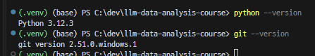
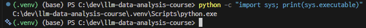
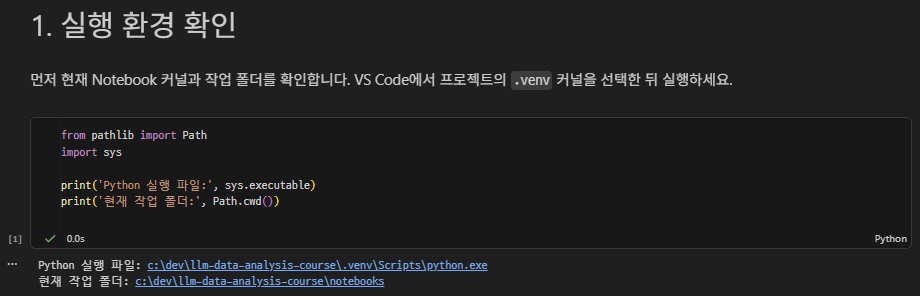
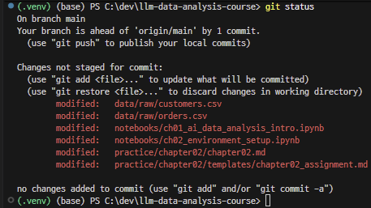
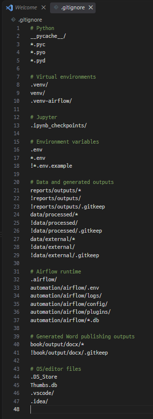

# Chapter 02 제출 답안. VS Code에서 시작하는 데이터 분석 환경

> 최종 파일은 개인 GitHub 저장소의 `chapter02/chapter02.md`로 저장하는 것을 권장합니다.

## 0. 제출 정보

- 이름: 배성윤
- GitHub ID: aeuyui
- 개인 저장소: `llm-data-analysis-study`
- 작성일: 26-09-14
- 운영체제: windows (powershell)

### 최종 제출 URL

```text
https://github.com/aeuyui/llm-data-analysis-study/blob/main/chapter02/chapter02.md
```

---

## 1. Python과 Git 환경 확인

### 실행 내용

```text
python --version 또는 py --version
git --version
```

### 실행 결과

```text
(.venv) (base) PS C:\dev\llm-data-analysis-course> python --version
Python 3.12.3
(.venv) (base) PS C:\dev\llm-data-analysis-course> git --version
git version 2.51.0.windows.1
```

### Evidence



### 결과 관찰

Python과 Git의 버전 정보를 확인한 결과, Python은 `3.12.3`, Git은 `2.51.0.windows.1`로 확인되었다. 두 명령 모두 정상적으로 실행되어 현재 환경에서 Python과 Git을 사용할 수 있음을 확인하였다.

### 나의 해석과 판단

Python과 Git 명령이 모두 정상적으로 실행되고 버전 정보도 확인되었으므로, 현재 환경은 Chapter 02의 실습을 진행하기에 적합하다고 판단된다.

### 업무·분석적 의미

프로젝트를 시작하기 전에 Python과 Git의 설치 및 버전을 확인하면 필요한 도구가 정상적으로 실행되는지 미리 확인할 수 있다. 또한 프로젝트를 진행하면서 발생하는 환경 관련 오류를 줄이고, 다른 환경에서 실행할 때 현재 사용한 개발 환경을 파악하는 데 도움이 된다.

### 한계와 추가 확인 사항

아직 프로젝트의 .venv 가상환경이 정상적으로 연결되었는지와 필요한 패키지가 설치되었는지는 확인하지 않았다. 이후 단계에서 .venv의 Python 실행 경로와 패키지 설치 상태를 추가로 확인할 것이다.

---

## 2. 저장소와 `.venv` 준비

### 수행 내용

- [x] 공식 Public 저장소 clone
- [x] 프로젝트 루트 확인
- [x] `.venv` 생성
- [x] `.venv` 활성화
- [x] `requirements.txt` 설치

### 핵심 실행 결과

```text
현재 프로젝트 경로: c:\dev\llm-data-analysis-course
터미널 Python 실행 파일: c:\dev\llm-data-analysis-course\.venv\Scripts\python.exe
가상환경 활성화 여부: O
패키지 설치 결과: O
```

### Evidence



### 결과 관찰

프로젝트 루트는 `c:\dev\llm-data-analysis-course`이고, 이 위치에서 `.venv`를 생성한 뒤 활성화했다. 활성화 후 확인한 Python 실행 파일은 `c:\dev\llm-data-analysis-course\.venv\Scripts\python.exe`로, 프로젝트 폴더 안의 실행 파일을 가리키고 있다. `requirements.txt` 설치도 치명적인 오류 없이 완료되었다.

### 나의 해석과 판단

시스템 Python과 프로젝트 `.venv`를 나누는 이유는 패키지 설치 위치를 프로젝트 단위로 고정하기 위함이다. 시스템 Python 한 곳에 모든 패키지를 설치하면 새로운 프로젝트를 실행할 때마다 요구하는 버전이 다르면 충돌이 발생하기 때문이다. `.venv`를 사용하면 한 프로젝트의 설치가 다른 프로젝트를 망가뜨리지 않게 한다.

또, 설치가 꼬였을 때 `.venv` 폴더를 지우고 다시 만들면 원래 상태로 돌아갈 수 있어 복구가 쉽다. `(.venv)` 표시만 믿지 않고 `sys.executable` 경로까지 확인하여 실제로 어떤 실행 파일이 동작하는지가 확인하였다.

### 업무·분석적 의미

다른 팀원에게 프로젝트를 넘겨줄 때 `.venv`와 `requirements.txt`가 있으면 받는 쪽이 쉽게 동일한 실행 환경을 만들 수 있다.
이런 과정을 사용하지 않고 원작자와 다른 버전이 깔리면 결과 차이의 원인을 추적하기 어려워진다.

### 한계와 추가 확인 사항

`requirements.txt`에 버전이 고정되어 있지 않다면, 같은 파일로 설치해도 시점에 따라 다른 버전이 깔릴 수 있다.
`.venv`는 Python 패키지만 격리한다. Python 자체의 버전, OS, 시스템 라이브러리는 격리 대상이 아니므로 다른 PC에서 동일하게 동작한다고 보장할 수 없다.
회사·기관 PC에서는 PowerShell 실행 정책이나 애플리케이션 제어로 가상환경 활성화나 `pip` 실행이 막힐 수 있다.

---

## 3. VS Code 인터프리터와 Jupyter 커널 연결

### 확인 결과

```text
VS Code Python 인터프리터: c:\dev\llm-data-analysis-course\.venv\Scripts\python.exe
Notebook sys.executable: c:\dev\llm-data-analysis-course\.venv\Scripts\python.exe
Notebook Path.cwd(): c:\dev\llm-data-analysis-course\notebooks
```

### Evidence



### 결과 관찰

VS Code의 Python 인터프리터와 Notebook 커널을 모두 프로젝트 `.venv`로 선택했다. Notebook에서 `sys.executable`을 출력한 결과는 `c:\dev\llm-data-analysis-course\.venv\Scripts\python.exe`로, STEP 2에서 확인한 터미널의 Python 실행 파일 경로와 동일했다.
`Path.cwd()`를 출력한 결과는 `c:\dev\llm-data-analysis-course\notebooks`로, Notebook 파일이 있는 폴더였다.

### 나의 해석과 판단

터미널 Python과 Notebook Python이 다르면 겉으로는 설치가 끝났는데 실행만 실패하는 상태가 된다. 예를 들어 터미널에서 `pip install pandas`가 성공했는데도 Notebook에서 `ModuleNotFoundError: No module named 'pandas'`가 뜨는 상황이 발생할 수 있다.

또는 양쪽에 같은 패키지가 버전만 다르게 깔려 있을 경우, 오류가 나지 않고 그냥 동작하되 결과나 경고 메시지가 달라지므로 문제를 발견하기 어렵다. 따라서 "같은 `.venv`인가"는 오류가 났을 때 확인하는 항목이 아니라 작업을 시작할 때 미리 확인하는 항목이라고 판단했다.

### 업무·분석적 의미

설치한 Python과 실행하는 Python을 같게 맞춰두면, 환경 오류와 코드 오류를 구분하는 데 드는 시간이 크게 줄어든다. `ModuleNotFoundError`가 떴을 때 재설치를 반복하는 대신 인터프리터 경로부터 비교하여 쉽게 원인을 특정할 수 있다.

오류를 공유할 때 코드와 메시지만 보내면 받는 사람도 똑같이 추측해야 하지만, `sys.executable`과 `Path.cwd()`를 함께 보내면 환경 문제인지 아닌지가 드러난다.

### 한계와 추가 확인 사항

과거에 `ipykernel install`로 등록한 커널이 남아 있으면 이름은 같아도 다른 Python을 가리킬 수 있으므로, 이름이 아니라 `sys.executable` 출력값으로 확인해야 한다.
인터프리터가 같아도 `Path.cwd()`는 실행 방식에 따라 루트가 되기도 하고 `notebooks`가 되기도 하므로 경로 문제는 커널 확인과 별개로 점검해야 한다.
이번에는 `sys.executable`만 확인했고, 개별 패키지가 실제로 그 `.venv`에서 import되는지(`pandas.__file__` 등)는 확인하지 않았다.
현재 PC에 Anaconda base가 함께 있으므로, 다른 Notebook을 열 때 커널이 기본값으로 되돌아가지 않는지 주의할 필요가 있다.

---

## 4. 샘플 데이터와 Notebook 실행 검증

### 확인 결과

```text
DATA_DIR 존재 여부: O
customers.csv 존재 여부: O
customers.shape: (150, 6)
주요 컬럼: ['customer_id', 'name', 'gender', 'age', 'city', 'signup_date']
```

### Evidence

.png)
.png)

### 결과 관찰

`Path.cwd()`가 `notebooks` 폴더였지만, 경로 설정 셀이 상위 폴더까지 검사해 `PROJECT_ROOT`를 `c:\dev\llm-data-analysis-course`로 잡았고 `DATA_DIR.exists()`는 `True`를 반환했다. 이어서 `pd.read_csv()`로 `customers.csv`를 읽었고 `customers.head()`가 표 형태로 정상 출력되었다.

데이터는 150행 6열이며 컬럼은 `customer_id`, `name`, `gender`, `age`, `city`, `signup_date`다. `info()` 결과 6개 컬럼 모두 결측치 없이 150개의 값이 채워져 있었고, `customer_id`와 `age`는 정수형, 나머지 4개는 문자열이다.

### 나의 해석과 판단

이 셀이 오류 없이 끝났다는 것은 vscode, `.venv`, 커널, 패키지, 데이터 경로, 데이터 파일이 모두 연결되었다는 뜻이다.
다만 결측치가 없고 150행이라는 사실은 확인했지만, 값이 타당한 범위인지(예: `age`의 최소/최대), `customer_id`가 실제로 중복 없는 식별자인지, `gender`에 어떤 값들이 들어 있는지는 아직 보지 않았다. `signup_date`도 문자열로 저장되어 있어 기간 필터나 정렬을 하려면 변환이 필요하다.

### 업무·분석적 의미

문제의 위치를 좁히는 효과가 있다. `read_csv`와 `shape`, `info()`를 확인하면, 이후에 오류가 나더라도 환경과 데이터 로딩은 정상임이 확정되어 있어 남은 원인은 그 뒤에 작성한 코드나 데이터의 내용 쪽으로 좁혀진다.

### 한계와 추가 확인 사항

이번 단계에서 확인한 것은 환경 연결이며, 데이터를 실제로 사용할 수 있는지에 대한 품질 검증은 진행하지 않았다.
`head()`로 본 것은 앞 5행뿐이므로 나머지 145행에 이상값이나 예상 밖의 값이 있는지는 알 수 없다.
`info()` 기준으로 결측치는 없지만, 빈 문자열이나 "없음" 같은 문자열 결측은 별도 확인이 필요하다.
`signup_date`가 문자열로 읽혀 있어, 날짜 연산이 필요하면 `pd.to_datetime()` 변환과 형식 검증이 필요하다.
`customer_id`의 유일성, `age`의 값 범위, `gender`·`city`의 고유값 목록은 아직 확인하지 않았다.

---

## 5. 오류 해결 기록

실습 중 오류가 있었다면 작성합니다. 오류가 없었다면 `해당 없음`이라고 적습니다.

### 오류 메시지

```text
해당 없음
```

### 원인 후보

1. 해당 없음
2.
3.

### 내가 확인한 순서

1. 해당 없음
2.
3.

### 해결 방법

```text
해당 없음 
```

### Evidence

```text
해당 없음
```

### 나의 해석과 판단

해당 없음

### 한계와 추가 확인 사항

해당 없음

---

## 6. Secret 보호 확인

- [x] `.env`는 Git 추적 대상이 아닙니다.
- [x] 실제 API Key를 코드에 작성하지 않았습니다.
- [x] 캡처 화면에 Token/비밀번호가 없습니다.
- [x] `.venv`를 Git에 올리지 않습니다.

### Evidence

필요한 경우 `git status`, `.gitignore` 확인 화면을 첨부합니다.





### 나의 해석과 판단

`.gitignore`에 `.env`, `.venv/`, `__pycache__/`, `.ipynb_checkpoints/`가 포함되어 있고, `git status`에 `.env`가 나타나지 않는 것을 확인했다. 즉 `.env`는 Git 추적 대상이 아니다.

코드는 모두가 공유해야 하는 내용이고, API Key는 나만 가져야 하는 내용이다. 성격이 다른 두 가지를 같은 파일에 두면 공유할 때마다 지우는 작업이 필요해진다. `.env`로 분리해 두면 코드는 그대로 공유하되 값만 각자 채우는 구조가 된다.

Git은 기록을 지우기 어렵다. Key를 커밋하면 이후 커밋에서 삭제해도 과거 커밋에는 그대로 남게되어 개인정보보호에 신경써야한다.

Notebook 출력 셀, 터미널 로그, 화면 캡처, 오류 메시지에도 Key가 그대로 찍힐 수 있으므로, 캡처를 첨부하기 전과 LLM에 오류를 질문하기 전에 화면을 한 번 더 확인해야한다.
`.venv/`를 제외하는 것은 용량과 이식성 문제인데, 가상환경은 PC마다 새로 만드는 것이 정상이고 저장소에 올려도 다른 환경에서 그대로 동작하지 않기 때문이다.

---

## 7. Chapter 02 최종 회고

### 가장 중요했다고 생각한 환경 설정 1가지

```text
패키지를 설치한 Python과 Notebook 커널 Python을 같은 `.venv`로 일치시킨 것
```

### 그 이유

```text
나머지 설정들은 이 하나가 어긋나면 전부 무의미해지기 때문이다. requirements.txt 설치가 성공하고 데이터도 정상 생성되어 있어도, 커널이 다른 Python을 가리키면 Notebook에서는 ModuleNotFoundError가 발생한다. 이때 오류 메시지는 "pandas가 없다"고만 말하므로, 원인을 모르면 이미 설치된 패키지를 계속 재설치하며 시간을 쓰게 된다.

문제는 커널 선택에서 발생했는데 증상은 import 줄에서 나타나므로, 코드만 들여다봐서는 찾을 수 없다. 그러나 sys.executable 한 줄을 확인하면 몇 초 만에 판정이 끝난다. 확인 비용이 매우 싸고 놓쳤을 때의 비용이 큰 항목이라는 점에서 가장 중요하다고 판단했다.

또 이번 실습에서 프롬프트의 `(.venv)` 표시만 믿으면 안 된다는 것을 배웠다. 표시는 겉모습이고 실제 근거는 실행 파일 경로이므로, 앞으로도 표시가 아니라 값으로 확인하기로 했다.
```

### 다음 Chapter에서 재사용할 환경 체크 3가지

1. Notebook 첫 셀에서 `sys.executable`을 출력해 프로젝트 `.venv` 경로가 맞는지 확인한다. 터미널에서 설치 작업을 했다면 그 터미널의 경로와도 대조한다.
2. `Path.cwd()`와 `DATA_DIR.exists()`를 함께 출력해, 현재 작업 폴더가 루트인지 `notebooks`인지 확인하고 상대 경로가 유효한지 점검한다.
3. 데이터를 읽은 직후 `shape`, 컬럼 목록, `info()`를 출력해 최소 스모크 테스트를 하고, 캡처나 질문을 남기기 전에 출력에 Secret이나 개인정보가 없는지 확인한다.

### 현재 환경의 한계 또는 주의점

```text
이번 장에서 확인한 것은 실행환경의 연결이며, 데이터 품질은 아직 검증하지 않았다. `customers.csv`도 가상 데이터이므로 분포나 경향을 현실에 대한 사실로 해석해서는 안 된다.

이 PC에는 Anaconda base 환경이 함께 있어 프롬프트에 `(.venv)`와 `(base)`가 동시에 표시된다. 터미널을 새로 열거나 다른 Notebook을 열 때 의도하지 않은 환경이 잡힐 수 있으므로 매번 실행 파일 경로를 확인해야 한다.

`requirements.txt`에 버전이 고정되어 있지 않다면 설치 시점에 따라 다른 버전이 깔릴 수 있다. 결과를 정확히 재현해야 하는 상황이라면 `pip freeze` 결과를 별도로 남겨 둘 필요가 있다.
```

---

## 최종 제출 체크

- [x] 핵심 Evidence 4~7장을 첨부했습니다.
- [x] 단순 캡처가 아니라 관찰과 판단을 작성했습니다.
- [x] Secret/개인정보가 없습니다.
- [x] GitHub에서 이미지가 정상 표시됩니다.
- [x] 개인 저장소에 `chapter02/chapter02.md`를 업로드했습니다.
- [x] 저장소 URL이 아니라 최종 파일 URL을 제출합니다.