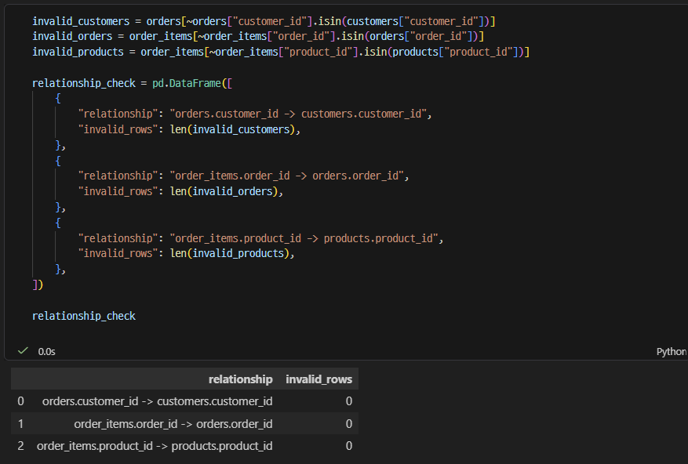
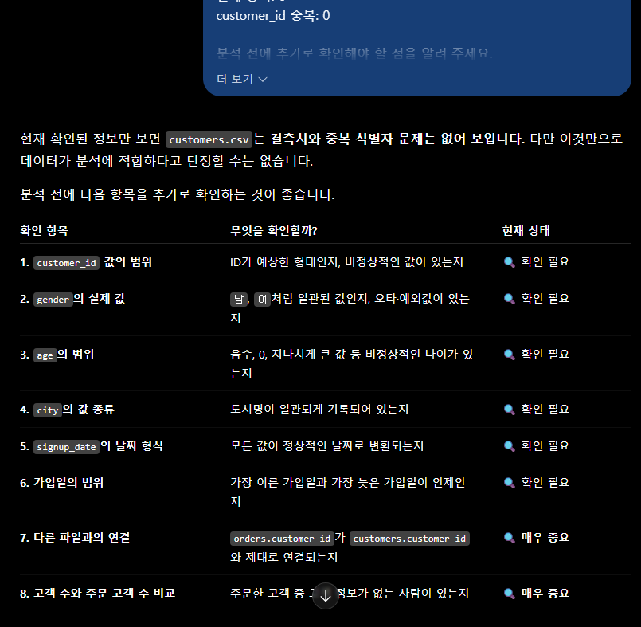

# Chapter 03 제출 답안 양식. 데이터의 첫인상 읽기

> 주 제출물은 실행 완료 Notebook `chapter03/chapter03.ipynb`입니다. 이 양식의 항목을 Notebook의 Markdown 셀로 추가해 작성합니다.

## 0. 제출 정보
- 이름: 배성윤
- GitHub ID: aeuyui
- 작성일: 2026-09-21
- 최종 제출 URL: https://github.com/aeuyui/llm-data-analysis-study/blob/main/chapter03/chapter03.md

## 1. 데이터 로딩과 구조 확인
### 실행/결과
- 4개 CSV 로딩 여부: Y
- 각 데이터 shape:
    - customers: (150,6)
    - products: (100, 4)
    - orders: (300, 5)
    - order_items: (764, 5)
- 주요 컬럼: 
    - customers: customer_id, name, gender, age, city, signup_date
    - products: product_id, product_name, category, price
    - orders: order_id, customer_id, order_date, payment_method, order_status
    - order_items: order_item_id, order_id, product_id, quantity, unit_price
- dtypes에서 주목한 컬럼:
    - customers.signup_date, orders.order_date: 값은 '2026-07-13'처럼 날짜 형태지만 dtype은 `object`(문자열)
    - 모든 '*_id' 컬럼 -> 'int64'로, age·price 같은 일반 숫자형과 같은 타입으로 저장됨
    - `customers.name` -> 개인정보 성격의 컬럼

### Evidence
.png)
.png)
.png)

### 결과 관찰
1. 4개 데이터셋 중 행이 가장 많은 것은 order_items(764행)이며, orders(300행)의 약 2.5배이다.
2. 'info()' 결과 4개 데이터셋 모든 컬럼의 Non-Null Count가 전체 행 수와 같았다.
3. 타입 구성: customers는 int64 2개/object 4개, products는 int64 2개/object 2개, orders는 int64 2개/object 3개, order_items는 5개 컬럼이 모두 int64였다.
4. 날짜 성격의 컬럼 2개('signup_date', 'order_date')는 모두 object로 읽혔다.
5. 'customer_id'는 customers와 orders에, 'order_id'는 orders와 order_items에, 'product_id'는 products와 order_items에 공통으로 존재한다.

### 나의 해석과 판단
1. 날짜 컬럼('order_date', 'signup_date'): 문자열 상태로는 월별 집계나 기간 계산을 할 수 없고, 형식이 섞여 있으면 정렬도 틀어질 수 있다. 'pd.to_datetime()' 변환과 변환 실패 건수 확인이 먼저 필요하다.
2. order_items: 행 수가 orders보다 많기 때문에, 한 행이 "주문 1건"이 아니라 "주문에 담긴 상품 1개"를 뜻하는 것으로 보인다.
3. ID 컬럼: int64라서 'describe()'에 평균·표준편차가 함께 계산되지만 이는 의미 없는 값이다. ID는 계산 대상이 아니라 식별·연결용으로 다뤄야 한다.
4. 'customers.name': 분석에는 필요 없는 개인정보이므로 LLM 입력이나 결과 공유에서 제외해야 한다.


### 업무·분석적 의미
1. 실제 컬럼명을 확인하지 않으면 'cust_id'처럼 존재하지 않는 컬럼명으로 코드를 작성해 오류가 나거나, LLM이 만든 코드를 그대로 신뢰하게 된다.
2. 날짜가 문자열인 것을 모르고 분석하면 월별 매출·기간 비교가 불가능하거나 잘못 계산된다.
3. 테이블의 행 단위(고객/상품/주문/주문상품)를 구분하지 않으면 주문 수·고객 수를 과대 집계하거나, 병합 시 행이 늘어나는 것을 알아채지 못한다.
4. 구조 확인은 이후 모든 집계와 병합 결과를 믿을 수 있는지 판단하는 기준이 된다.

### 한계와 추가 확인 사항
1. Non-Null Count는 'NaN'만 결측으로 센다. 빈 문자열, 공백, "확인필요" 같은 텍스트가 섞여 있어도 결측으로 잡히지 않으므로 점검이 필요하다.
2. 날짜 문자열이 모두 같은 형식인지, 실제 날짜로 변환 가능한지 아직 확인하지 않았다.
3. ID의 중복 여부와, 파일 간 ID가 실제로 연결되는지(없는 ID 존재 여부)는 아직 모른다.
4.  age/price/quantity/unit_price의 범위와 이상치, 범주형 값의 표기 차이도 확인 전이다.
5. 'head()'에서는 gender가 모두 F, 'tail()'에서는 모두 M으로 보였다. 앞뒤 5행만으로는 전체 분포를 알 수 없으므로 빈도 확인이 필요하다.

## 2. 결측·중복·키 품질
- 주요 ID 결측: customers.customer_id 0 / products.product_id 0 / orders.order_id 0 / order_items.order_item_id 0 (연결용 FK인 orders.customer_id, order_items.order_id, order_items.product_id도 모두 0)
- 주요 ID 중복: customers.customer_id 0 / products.product_id 0 / orders.order_id 0 / order_items.order_item_id 464
- 전체 행 중복: 모두 0

.png)
.png)
.png)

### 결과 관찰
1. 4개 데이터셋의 모든 컬럼에서 'isna()' 기준 결측치는 0건, 결측률은 0%였다. (결측 요약표의 '0.0'은 여러 데이터셋을 concat으로 합치며 생긴 float 표시이며, 개별 확인 결과는 정수 0이다.)
2. 모든 값이 완전히 같은 전체 행 중복은 4개 데이터셋 모두 0건이었다.
3. customers.customer_id, products.product_id, orders.order_id는 중복이 0건으로, 각 테이블 안에서 ID가 유일했다.
4. order_items.order_id는 464건이 반복되었다. 전체 764행에서 반복 464건을 빼면 고유한 주문 ID는 300개로 계산되며, 이는 orders의 행 수(300)와 같다.


### 나의 해석과 판단
중복 숫자는 컬럼의 역할(PK/FK)에 따라 의미가 다르다. customers.customer_id의 중복은 같은 고객이 두 번 등록된 오류지만, order_items.order_id의 반복은 한 주문에 여러 상품이 담긴 정상 구조다. 따라서 중복 개수만 보고 삭제하면 정상적인 주문 상세를 지우게 된다.

order_items의 고유 order_id가 orders의 행 수와 같다는 점에서, 모든 주문에 상세 행이 1개 이상 있고 주문당 평균 약 2.55개(764 ÷ 300) 상품이 담겨 있다고 판단된다.

문제가 발견될 경우 처리 우선순위는 다음과 같이 판단한다.
1. PK 결측/중복: 모든 병합과 집계의 기준이므로 가장 먼저 확인해야 한다. PK가 중복되면 병합 시 행이 불어나 매출이 이중 집계된다.
2. FK 결측/연결 오류: 주문이 어느 고객/상품에 속하는지 알 수 없게 되므로 두 번째로 본다.
3. 분석 대상 컬럼의 결측: age, price, quantity 등은 평균/합계를 왜곡하므로 분석 목적에 맞춰 처리 방법을 정한다.
4. 전체 행 중복: 원인(중복 적재 등)을 확인한 뒤 제거 여부를 결정한다.

### 업무·분석적 의미
1. 고객 ID가 중복되면 고객 수가 부풀려지고, 병합 시 한 주문이 여러 번 복제되어 매출이 실제보다 크게 계산된다.
2. 결측치를 확인하지 않으면 pandas의 평균/합계가 결측을 자동으로 빼고 계산해, 분석 대상 수가 줄어든 것을 모른 채 결과를 보고하게 된다.
3. order_items의 행 수(764)를 주문 수로 착각하면 주문 수가 실제(300)의 약 2.5배로 보고된다.
4. 품질 점검 결과를 수치로 남겨 두면, 이후 데이터가 새로 생성되거나 바뀌었을 때 같은 기준으로 비교할 수 있다.


### 한계와 추가 확인 사항
1. order_items의 PK인 order_item_id는 결측 0은 확인했지만, 중복 여부는 아직 점검하지 않았다.
2. 'duplicated()'는 모든 값이 완전히 같은 행만 중복으로 본다. ID만 다르고 나머지 값이 같은 행(예: 같은 고객의 이중 등록, 같은 주문 안에 같은 상품이 두 행으로 나뉜 경우)은 이 방법으로 잡히지 않는다.
3. 'isna()'는 NaN만 센다. 빈 문자열, 공백, "없음", "확인필요" 같은 대체 값이 결측을 뜻하는지는 문자열 값과 범주형 빈도(Step 3)를 확인해야 한다.
4. 각 테이블 안에서 ID가 유일하다는 것만으로 파일 간 ID가 실제로 연결된다는 보장은 없다.
5. 고객 150명 중 실제로 주문한 고객 수, 상품 100개 중 실제로 주문된 상품 수는 아직 확인하지 않았다.

## 3. 숫자형·범주형·날짜 점검
- 숫자형 범위에서 주목한 값: 
    1. 'age': 19 ~ 69세 (평균 약 42.1세, 중앙값 40세)
    2. 'price': 5,000 ~ 200,000원 (평균 110,040원, 중앙값 112,000원)
    3. 'quantity': 1 ~ 5개 (평균 약 3.05개)
    4. 'unit_price': 5,000 ~ 200,000원 -> 'price'와 최소·최대가 같음
- 범주형 빈도에서 주목한 값:
    1. 'order_status': completed 184 / cancelled 64 / refunded 52 -> 취소·환불이 116건
    2. 'category': 7종, 스포츠 19개가 가장 많고 식품 7개가 가장 적음
    3. 'city': 10종, 성남 21명이 가장 많고 고양 11명이 가장 적음
    4. 고유값 수: gender 2, payment_method 4, order_status 3    

- 날짜 변환 실패 건수: 0건
- 날짜 범위: 2025-09-14 ~ 2026-09-13

.png)
.png)

### 결과 관찰
1. age, price, quantity, unit_price 모두 음수나 0 같은 명백히 불가능한 값은 최솟값에서 보이지 않았다.
2. price와 unit_price는 최솟값과 최댓값이 같았고, 평균과 중앙값도 유사했다.
3. 병합 결과 앞 5행에서는 'unit_price'와 상품의 'price'가 모두 같은 값이었다.
4. 가격 값은 모두 1,000원 단위였다.
6. order_status는 3종이며 completed가 약 61.3%, cancelled 약 21.3%, refunded 약 17.3%였다.
8. order_date는 변환 실패 없이 모두 날짜로 바뀌었고, 연,월,요일('dt.year', 'dt.month', 'dt.day_name()') 추출이 정상 동작했다.

### 나의 해석과 판단
1. 취소·환불 비율 약 38.7%: 일반적인 쇼핑몰 기준으로 높아 보이지만, 오류라고 단정할 수는 없다.
   - 'cancelled'와 'refunded'의 업무 정의(결제 전 취소인지, 결제 후 환불인지)를 확인해야 한다.
   - 환불 주문이 원래 completed였다가 바뀐 것인지, 기간·결제수단별로 몰려 있는지 확인해야 한다.
   - 매출 분석 시 어떤 상태를 포함할지 기준을 먼저 정해야 한다.
2. 카테고리와 맞지 않아 보이는 가격: 식품 186,000원, 도서 142,000원은 선물세트/전집이라면 가능하지만, 카테고리와 무관하게 가격이 매겨졌을 가능성도 있다.
3. unit_price와 price의 관계: 앞 5행이 같았다고 전체가 같다고 볼 수는 없다.
   - 전체 행에서 두 값이 다른 경우가 있는지 확인해야 한다.
   - 차이가 있다면 할인·가격 변경인지, 오류인지 판단할 기준이 필요하다.
4. age 19 ~ 69세, quantity 1 ~ 5개: 범위 자체는 자연스럽지만 미성년자가 없는 것이 가입 정책 때문인지, 수량 상한 5가 구매 제한 정책 때문인지는 데이터만으로 알 수 없다.

### 업무·분석적 의미
1. order_status를 확인하지 않고 전체 주문 금액을 합산하면, 취소·환불 116건이 포함되어 매출이 과대 보고된다.
2. 부분 월(2025년 9월, 2026년 9월)을 완전 월과 같은 기준으로 비교하면, 해당 월 매출이 실제보다 낮게 보여 "매출 감소"로 잘못 해석될 수 있다.
3. ID 컬럼이 describe() 결과에 섞여 나오므로, 숫자형이라고 모두 분석 대상이 아니라는 점을 구분해야 한다.
4. 범주 값의 표기가 통일되어 있어야 그룹별 집계가 정확하다. 현재 city/category/order_status는 그룹 분석 기준으로 쓸 수 있는 상태로 보인다.

### 한계와 추가 확인 사항
1. 'customers.signup_date'는 아직 날짜로 변환하지 않아, 변환 실패 건수와 가입일 범위를 확인하지 못했다.
2. gender와 payment_method는 고유값 수만 확인했고, 값별 빈도는 확인하지 않았다. head()는 모두 F, tail()은 모두 M이어서 전체 분포를 따로 확인해야 한다.
3. describe()의 최소/최대만으로는 분포 모양이나 극단값의 개수를 알 수 없다. 히스토그램이나 박스플롯 같은 분포 확인이 필요하다.
4. 카테고리별 가격 범위, unit_price와 price의 전체 일치 여부는 확인하지 않았다.
5. 취소·환불 비율이 높은 원인은 현재 데이터(상태 값만 있음)만으로는 알 수 없다.

## 4. CSV 간 키 관계 검증
- 없는 `customer_id`: 0건
- 없는 `order_id`: 0건
- 없는 `product_id`: 0건



### 결과 관찰
1. 'isin()'으로 자식 테이블(FK)의 ID가 부모 테이블(PK)에 있는지 확인한 결과, 세 관계 모두 부모 테이블에 없는 ID가 0건이었다.
2. 연결에 쓰인 ID 컬럼은 부모·자식 테이블 모두 int64 타입으로 같았다.
3. order_items에 products를 'product_id' 기준으로 left merge한 결과, 앞 5행에서 product_name, category, price가 모두 채워졌다.
4. 병합 후 계산한 카테고리별 주문 금액(quantity × unit_price 합계)은 7개 카테고리 모두 값이 계산되었다.

### 나의 해석과 판단
세 관계 모두 끊긴 ID가 없으므로, 고객 > 주문 > 주문 상세 > 상품으로 이어지는 연결 구조는 유지되고 있다고 판단한다.

Step 2와 함께 보면 다음도 판단할 수 있다.
- order_items의 고유 order_id는 300개이고, 이 300개가 모두 orders(300행, order_id 중복 0)에 존재한다. 따라서 orders의 모든 주문에 주문 상세가 1건 이상 있다.
- products.product_id는 중복이 0이므로, order_items에 products를 병합해도 한 행이 여러 행으로 복제되지 않는다.

만약 키 관계 문제가 발견되었다면 바로 삭제하면 안 된다. 이유는 다음과 같다.
1. 원인이 데이터 자체가 아닐 수 있다: 부모 파일 일부 누락, 추출 시점 차이(주문은 최신인데 고객 파일은 과거 버전), ID 타입 차이(숫자 1과 문자 "1"), 앞뒤 공백 때문에 실제로 있는 ID가 없는 것처럼 보일 수 있다.
2. 업무적으로 정상인 경우가 있다: 판매가 종료되어 상품 마스터에서 지워진 상품, 탈퇴한 고객의 과거 주문은 실제 매출 기록이다.
3. 삭제하면 결과가 조용히 바뀐다: 해당 주문의 금액이 매출에서 빠져도 코드는 오류 없이 실행되므로 누락을 알아채기 어렵다.
4. 원인을 덮어 버린다: 삭제하면 문제를 발견하고 고칠 기회를 잃는다.

따라서 문제 행을 따로 추출해 건수와 패턴을 확인하고, 원인을 파악한 뒤 제외, 보정, '미확인' 범주 처리 중 하나를 선택하고 그 기준을 기록해야 한다.

### 업무·분석적 의미
1. 키 관계를 검증하지 않고 병합하면, inner join에서는 연결되지 않는 주문이 경고 없이 사라지고 left join에서는 상품 정보가 NaN인 행이 생긴다. 어느 쪽이든 카테고리별/고객별 매출이 틀어진다.
2. 부모 테이블의 PK가 중복된 상태로 병합하면 행이 복제되어 매출이 이중 집계된다. 그래서 Step 2의 PK 중복 점검과 Step 4의 관계 검증을 함께 확인해야 병합 결과를 신뢰할 수 있다.

### 한계와 추가 확인 사항
1. 이번 검증은 '자식 → 부모' 방향만 확인했다. 반대 방향인 주문이 한 번도 없는 고객 수, 한 번도 주문되지 않은 상품 수는 확인하지 않았다.
2. ID가 부모 테이블에 '존재'하는지만 확인했을 뿐, 연결된 내용이 논리적으로 맞는지는 확인하지 않았다. 예를 들어 가입일보다 앞선 주문이 있는지, unit_price가 상품의 price와 전체적으로 일치하는지는 모른다.
3. 병합 결과는 앞 5행만 확인했으므로, 병합 전후 행 수가 같은지는 직접 비교하지 않았다.

## 5. LLM 구조 설명 검증
- LLM에 제공한 Safe Context:
```text
customers.csv 구조 요약

행/열: (150, 6)
컬럼: customer_id, name, gender, age, city, signup_date
데이터 타입: customer_id int64, name object, gender object, age int64, city object, signup_date object
결측치: 모든 컬럼 0 (isna 기준)
전체 중복: 0
customer_id 중복: 0

분석 전에 추가로 확인해야 할 점을 알려 주세요.
확인하지 않은 내용은 단정하지 말고,
추정과 실제 확인이 필요한 항목을 구분해 주세요.
```
- LLM이 제안한 추가 점검:

| No. | 구분 | 확인 항목 | 확인 내용 | 중요도 | 상태 |
| :-: | :-: | --- | --- | :-: | :-: |
| 1 | ID | `customer_id` 값 범위 | 예상한 형태인지, 비정상 값이 있는지 | 보통 | 확인 필요 |
| 2 | 값 | `gender` 실제 값 | 값이 일관된지, 오타·예외값이 있는지 | 보통 | 확인 필요 |
| 3 | 값 | `age` 범위 | 음수, 0, 지나치게 큰 값이 있는지 | 보통 | 확인 필요 |
| 4 | 값 | `city` 값 종류 | 도시명이 일관되게 기록되었는지 | 보통 | 확인 필요 |
| 5 | 날짜 | `signup_date` 형식 | 모든 값이 날짜로 변환되는지 | 보통 | 확인 필요 |
| 6 | 날짜 | 가입일 범위 | 가장 이른·늦은 가입일이 언제인지 | 보통 | 확인 필요 |
| 7 | 관계 | 다른 파일과의 연결 | `orders.customer_id`가 `customers.customer_id`와 연결되는지 | 높음 | 확인 필요 |
| 8 | 관계 | 고객 수와 주문 고객 수 비교 | 주문 고객 중 고객 정보가 없는 사람이 있는지 | 높음 | 확인 필요 |
- 실제 데이터에서 확인한 항목: 1,3,4,7 + 2(일부)
- 채택/수정/보류한 내용:
     8개 제안 중 채택 4개(1, 3, 4, 7), 수정 2개(2, 8), 보류 2개(5, 6)

| No. | LLM 제안 | 판단 | 이유 |
| :-: | --- | :-: | --- |
| 1 | `customer_id` 값 범위 | 채택 | 1 ~ 150, 결측 0, 중복 0으로 비정상 값 없음 확인 |
| 2 | `gender` 실제 값 (남/여 일관성) | 수정 | 제안은 '남', '여'를 전제했지만 실제 값은 F, M으로 관찰됨. 기대값을 F, M으로 고쳐 점검. 고유값 2개는 확인, 값별 빈도는 미확인 |
| 3 | `age` 범위 | 채택 | 19 ~ 69세로 음수, 0, 극단값 없음 확인 |
| 4 | `city` 값 종류 | 채택 | 10종 모두 출력, 표기 차이 없음 확인 |
| 5 | `signup_date` 형식 | 보류 | 날짜 변환을 실행하지 않음 |
| 6 | 가입일 범위 | 보류 | 5번 변환 후 확인 가능 |
| 7 | 다른 파일과의 연결 | 채택 | 없는 customer_id 0건 확인 |
| 8 | 고객 수와 주문 고객 수 비교 | 수정 | 원래 내용은 7번과 같은 점검이라 '주문하지 않은 고객 수'로 방향을 바꿈. 바꾼 점검은 미실행(보류) |



### 나의 해석과 판단
```text
가장 유용했던 제안은 결론의 표현 수준을 바로잡아 준 점이다. 결측치 0, 전체 행 중복 0, customer_id 중복 0이라는 요약만 보면 'customers.csv에 품질 문제가 없다'고 결론 내리기 쉽다. LLM은 이를 '결측치와 중복 식별자는 확인되지 않았다' 정도로 표현해야 한다고 제안했다. 이 결과는 품질 점검의 일부일 뿐이라는 점을 분명히 해 준 것이다. 또한 int64 타입이라는 사실만으로 age 값이 정상이라고 볼 수 없다는 점, object 타입인 signup_date는 아직 날짜로 인식된 것이 아니라는 점을 구체적으로 짚었다. 이 두 가지는 타입 확인과 값 확인이 별개라는 것을 알려 준 유용한 지적이었다.
LLM이 가장 중요하다고 강조한 orders와의 연결(7번)은 관계 검증 결과 없는 customer_id가 0건이었다. 강조한 이유는 타당했고, 실제 데이터에서도 문제가 없음을 확인했다.

가장 조심해야 할 것은 LLM이 실제 값을 보지 않고 만든 전제다.
1. 실제와 다른 값을 전제했다: gender를 '남', '여'처럼 일관된 값인지 확인하라고 했지만, 실제 데이터의 값은 F, M이었다. 이 제안을 그대로 따라 '남', '여' 기준으로 필터링하거나 검증 코드를 작성했다면 결과가 0건이 되거나 모든 값이 이상값으로 판정되었을 것이다.
2. 같은 점검을 두 번 제안했다: 8번 '주문한 고객 중 고객 정보가 없는 사람'은 7번 'orders.customer_id가 customers에 존재하는가'와 같은 점검이다. 목록 수가 많다고 점검 범위가 넓은 것은 아니므로, 제안을 그대로 쓰지 않고 8번을 '주문하지 않은 고객 수'로 방향을 바꿔 수정했다.
3. 확인된 사실의 조건을 생략했다: LLM은 '결측치 없음'을 확인된 사실로 분류했지만, 이는 'isna()' 기준으로 NaN이 없다는 뜻이다. 빈 문자열이나 대체 문자열까지 없다는 뜻은 아니다.
```

### 한계와 추가 확인 사항
1. 보류한 signup_date 날짜 변환(5번)과 가입일 범위(6번)는 아직 실행하지 않았다.
2. gender는 고유값이 2개(F, M 관찰)라는 것만 확인했고, 값별 빈도는 확인하지 않았다. head()에서는 모두 F, tail()에서는 모두 M으로 보여 전체 분포 확인이 필요하다.
3. 방향을 바꾼 8번 점검(고객 150명 중 주문하지 않은 고객 수)은 실행하지 않았다.
4. 빈 문자열/대체 문자열 결측, ID는 다르지만 같은 사람인 이중 가입, 가입일보다 앞선 주문 여부, name 컬럼(개인정보)의 분석/공유 제외 기준은 LLM 목록에 없었다.
5. 이번에는 customers.csv 한 개의 구조 요약만 제공했다. products, orders, order_items에 대해서는 LLM 검토를 받지 않았다.

## 6. Chapter 03 최종 판단
### 데이터의 첫인상 3가지
1. 구조적 품질은 양호하다. 문제가 발생할만한 중복데이터가 없었다. 세 가지 FK 관계에서도 부모 테이블에 없는 ID가 0건이어서, 고객 > 주문 > 주문 상세 > 상품으로 병합이 원활히 이루어졌다.
2. 테이블마다 행의 단위가 다르다. customers는 고객, products는 상품, orders는 주문, order_items는 '주문에 담긴 상품 1개' 단위다. 어떤 테이블의 행을 세느냐에 따라 '주문 수'가 전혀 달라진다.
3. 숫자를 바로 합산하면 안 되는 데이터다. 주문 300건 중 취소 64건, 환불 52건으로 약 38.7%가 completed가 아니다. 전체 주문기간의 양 끝 달은 부분 월이다. 따라서 '매출'과 '월'의 기준을 먼저 정하지 않으면 집계 결과가 왜곡된다.

### 다음 Chapter 전에 반드시 확인/처리해야 할 항목
1. 날짜 변환
   - 'customers.signup_date'를 날짜로 변환하고 변환 실패 건수와 가입일 범위를 확인한다.
   - 'orders.order_date' 변환은 원본을 수정하지 않기 때문에 Chapter 04에서 CSV를 다시 불러오면 변환을 다시 해야 한다.
2. 매출 계산 기준 정의
   - order_status 중 어떤 상태를 매출에 포함할지(completed만, 또는 refunded 제외 등) 기준을 정한다.
   - 금액 계산에 order_items.unit_price와 products.price 중 무엇을 쓸지 정하고, 두 값이 전체 행에서 일치하는지 확인한다.
   - 월별 분석에서 1일~31일까지의 데이터가 아닌 월(2025년 9월, 2026년 9월)을 어떻게 다룰지 정한다.
3. 보류한 품질 점검 실행
   - order_items.order_item_id 중복 여부
   - gender, payment_method의 값별 빈도
   - 빈 문자열·공백·대체 문자열 결측 여부
   - 주문이 없는 고객 수, 한 번도 주문되지 않은 상품 수

### 현재 데이터만으로 단정할 수 없는 것
- 취소·환불 비율이 정상인지: 상태 값의 업무 정의와 발생 원인(기간/결제수단/상품별 집중 여부)을 알 수 없어, 오류인지 실제 운영 특성인지 판단할 수 없다.
- 카테고리와 가격의 관계가 맞는지: 식품 186,000원, 도서 142,000원 같은 값이 실제 가능한 상품인지, 카테고리와 무관하게 생성된 값인지 알 수 없다.
- 카테고리별 주문 금액 순위가 매출 순위인지: 스포츠가 가장 컸지만, 이 금액에는 취소·환불 주문이 포함되어 있다. 따라서 실제 매출 순위라고 할 수 없다.
- 추세나 계절성: 기간이 약 1년이고 양 끝이 부분 월이므로, 월별 증감을 추세나 계절 효과로 해석할 수 없다.

## 최종 제출 체크
- [x] Notebook을 처음부터 끝까지 실행했습니다.
- [x] 오류 셀이 남아 있지 않습니다.
- [x] 핵심 Evidence를 첨부했습니다.
- [x] 관찰과 해석을 구분했습니다.
- [x] 개인정보/Secret이 없습니다.
- [x] `chapter03/chapter03.ipynb`가 GitHub에서 정상 표시됩니다.
- [x] 최종 Notebook 파일 URL을 제출합니다.