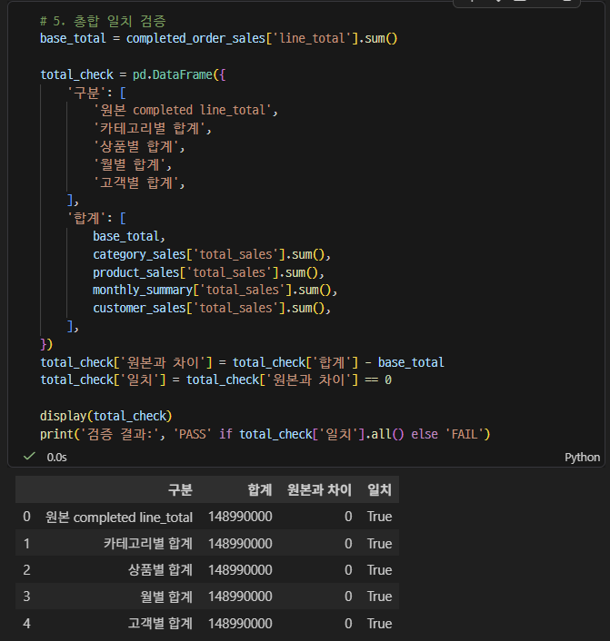
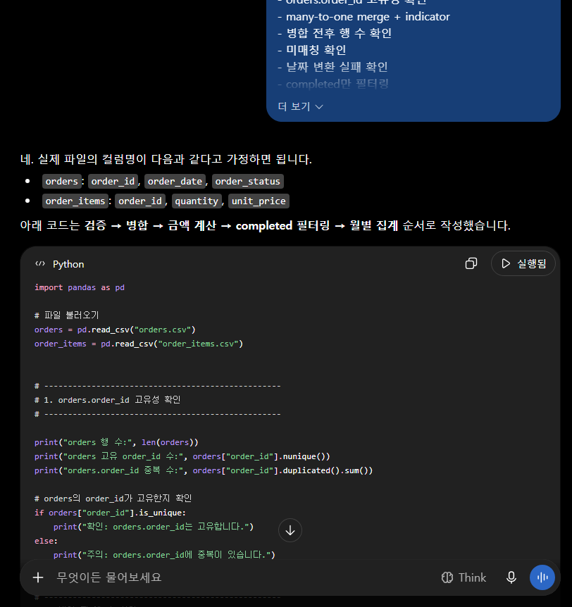

# Chapter 04 제출 답안 양식. pandas로 데이터에 질문하기

> 주 제출물은 실행 완료 Notebook `chapter04/chapter04.ipynb`입니다. 이 양식의 항목을 Notebook의 Markdown 셀로 추가해 작성합니다.

## 0. 제출 정보
- 이름: 배성윤
- GitHub ID: aeuyui
- 작성일: 2026-09-26
- 최종 제출 URL: https://github.com/aeuyui/llm-data-analysis-study/blob/main/chapter04/chapter04.ipynb

## 1. 질문과 필요한 데이터 선택
### 내가 확인하려는 질문
```text
어떤 상품 카테고리의 completed 주문 기준 금액(total_sales)이 가장 큰가?
```

### 사용한 파일/컬럼
| 파일 (shape) | 사용 컬럼 |
|---|---|
| order_items (764, 5) | order_id, product_id, quantity, unit_price |
| orders (300, 5) | order_id, customer_id, order_date, order_status |
| products (100, 4) | product_id, product_name, category, price |
| customers (150, 6) | customer_id, gender, age, city |

### 결과 관찰
- 4개 CSV를 모두 불러왔고, 필수 컬럼 누락으로 인한 KeyError는 발생하지 않았다.
- `order_status`의 실제 값은 completed 184건, cancelled 64건, refunded 52건의 3종류이며, 합계 300건은 orders 전체 행 수와 같다(결측 없음).
- `category`는 products에만, `order_status`와 `order_date`는 orders에만 있고, 금액 계산에 필요한 `quantity`, `unit_price`는 order_items에만 있다.

### 나의 해석과 판단
- 질문을 이루는 카테고리, 완료 여부, 금액 컬럼이 서로 다른 테이블에 흩어져 있으므로 최소 3개 테이블을 병합해야 한다. 가장 작은 단위인 order_items를 기준 테이블로 두고, orders와 products를 many-to-one으로 붙이는 구조로 병합하였다.
- 주문 상태는 추측하지 않고 value_counts로 실제 표기를 확인한 뒤 필터 값으로 사용했다. cancelled/refunded는 거래가 성립하지 않았거나 되돌려진 주문이므로 완료 주문 기준 질문의 범위에서 제외했다.

### 업무·분석적 의미
- 분석 전에 질문, 포함 범위, 계산식, 집계 단위를 먼저 고정하면 이후의 카테고리/상품/월/고객별 집계가 모두 같은 분모를 공유하게 되어 서로 비교하고 교차 검증할 수 있다.
- 보고서에 "total_sales = completed 주문의 quantity × unit_price 합계"라는 정의를 명시해 두면, 받는 사람이 이를 회계상 매출로 오해하는 일을 줄일 수 있다.

### 한계와 추가 확인 사항
- `unit_price`에 추가 할인이 반영되어 있는지 데이터만으로는 알 수 없다. `unit_price`와 `products.price`가 다른 행이 있는지 추가로 확인해 볼 수 있다.
- refunded가 전액 환불인지 부분 환불인지 알 수 없고, `order_status`는 특정 시점만을 나타내므로 현재 completed인 주문이 이후 환불될 가능성도 배제할 수 없다.
- 이번 질문은 "금액 규모"만 다루므로, 인기도나 수익성은 판단할 수 없다.

## 2. 필터링·정렬·파생 컬럼
- 적용한 필터 조건:
  - 연습용 고객 필터: `age >= 30` (111명), `city == "서울"` (15명), `city.isin(["서울", "부산"])` (31명)
  - 분석 범위 필터: `order_status == "completed"` (orders 300건 중 184건)
  - 필터 전 `value_counts()`로 실제 값(`서울`, `부산`, `completed` 등)이 존재하는지 먼저 확인함
- 정렬 기준:
  - products: `price` 내림차순 (고가 상품 확인)
  - customers: `age` 내림차순 (이름 등 개인정보 컬럼 제외 후 정렬)
  - 이후 집계표: `total_sales` 내림차순, 월별은 `order_month` 오름차순
- 만든 파생 컬럼:
  - `line_total`: 주문 상세 1행의 금액 (이번 단계)
  - 이후 단계에서 `order_month`, `sales_ratio`, `average_order_value`, `customer_label`을 추가로 생성
- `line_total` 계산식: `line_total = quantity × unit_price`
  - 예: order_id 1, product_id 100 → 3 × 102,000 = 306,000

.png)

.png)

### 결과 관찰
- customers의 city는 10개 도시(성남 21명 최다, 고양 11명 최소)이고, 필터에 사용한 `서울`, `부산`은 실제 값에 존재했다.
- 가격 상위 10개 상품은 뷰티 4개, 스포츠 3개, 패션·식품·생활용품 각 1개로 구성되었고, 전자기기와 도서는 없었다. 최고가는 뷰티 상품 099(200,000원)이다.
- 고객 최고 연령은 69세로 4명이 동률이었다.
- `line_total` 생성 후 전체 주문 상세 764행의 금액 합계는 255,610,000이다.
- completed 필터 후에는 474행, 148,990,000이 남았다. 제외된 금액은 106,620,000이다.

| 구분 | completed | 제외(cancelled+refunded) | completed 비중 |
|---|---|---|---|
| 주문 건수 | 184 | 116 | 61.33% |
| 주문 상세 행 수 | 474 | 290 | 62.04% |
| 금액 | 148,990,000 | 106,620,000 | 58.29% |
| 상세 1행당 평균 금액 | 약 314,325 | 약 367,655 | - |

### 나의 해석과 판단
- 255,610,000은 주문 상태를 연결하기 전 금액이므로 취소·환불 주문이 섞여 있다. 이 값을 보고하면 completed 기준보다 106,620,000(약 71.6%) 과대 계상된다. 그래서 이 단계의 합계는 "전체 주문 상세 금액"으로만 부르고 완료 주문 금액이라고 부르지 않았다.
- completed는 행 수 기준 62.04%인데 금액 기준으로는 58.29%이다. 제외된 주문 상세의 1행당 평균 금액이 더 크다는 뜻이므로, 필터를 빼면 총액이 행 수 비율보다 더 크게 부풀려진다.
- 필터 기준을 바꾸면 카테고리 간 비교도 달라질 수 있다. 취소·환불이 특정 카테고리에 몰려 있다면 전체 기준 순위와 completed 기준 순위가 다를 수 있다. 다만 현재 출력에는 상태별 카테고리 금액이 없어 실제로 순위가 바뀌는지는 확인하지 않았다.
- 연습용 고객 필터(30세 이상, 서울·부산)는 이번 질문의 범위가 아니므로 최종 집계에 적용하지 않았다. 적용했다면 모집단 자체가 바뀌어 전체 고객 기준 결과와 비교할 수 없다.
- 가격 상위 상품에 뷰티가 가장 많지만, 금액은 단가 × 수량이므로 정렬 결과만으로 카테고리 금액 순위를 추정하지 않았다.

### 업무·분석적 의미
- 같은 데이터라도 필터 정의에 따라 보고 금액이 약 1.7배 달라지므로, 수치를 공유할 때는 어떤 주문 상태를 포함했는지 반드시 함께 명시해야 한다.
- 필터 값을 추측하지 않고 `value_counts()`로 확인하면 표기 차이(예: `Completed`, `완료`) 때문에 결과가 0건이 되거나 일부가 누락되는 문제를 막을 수 있다.

### 한계와 추가 확인 사항
- `line_total`은 수량 × 단가일 뿐이며 할인·쿠폰·배송비·부가세 반영 여부는 알 수 없다.
- 상태별 카테고리 금액을 보지 않았으므로, 필터 기준이 카테고리 순위에 미치는 영향은 확인하지 않았다.
- 정렬 결과에 동률(197,000원 2개, 69세 4명 등)이 있어, 상위 N개로 자를 때 경계의 항목이 임의로 빠질 수 있다.

## 3. merge 검증
- 병합한 데이터:
  1. `order_items` <- `orders` (주문 상태·주문일·고객 ID 연결)
  2. `completed_order_sales` <- `products` (상품명·카테고리 연결, completed 필터 이후 수행)
  3. (참고) 고객별 집계 `customer_sales` <- `customers` (city만 연결)
- 사용한 key: `order_id`, `product_id`, (참고) `customer_id`
- `validate` 결과: `many_to_one` 두 병합 모두 MergeError 없이 통과. 사전 확인 결과 `orders.order_id` 중복 0, `products.product_id` 중복 0. 고객 병합의 `one_to_one`도 오류 없이 실행됨
- `indicator` 결과: (1) both 764 / left_only 0 / right_only 0, (2) both 474 / left_only 0 / right_only 0
- 병합 전/후 행 수: (1) 764 → 764, (2) 474 → 474
.png)

.png)

.png)

### 결과 관찰
- 두 병합 모두 병합 전후 행 수가 같고, 짝을 찾지 못한 왼쪽 행(left_only)이 없었다.
- 오른쪽 테이블의 key(`orders.order_id`, `products.product_id`)에 중복이 없었다.
- orders 병합 후 전체 금액 255,610,000과 completed 금액 148,990,000이 이후 단계에서도 그대로 사용되었다.
- 월별 `order_count` 합계(184)가 orders의 completed 건수(184)와 같으므로, 주문 상세가 하나도 없는 completed 주문은 없다.

### 나의 해석과 판단
- 오른쪽 key가 고유해 한 행이 여러 행으로 복제될 수 없다.
- 행 수가 변하지 않아 복제나 누락이 없다.
- left_only가 0이라 모든 주문 상세가 주문·상품 정보를 얻었다.
- 병합으로 인한 행 수 증가·감소는 없었다. 764행이 474행이 된 것은 병합이 아니라 병합 사이에 적용한 completed 필터 때문이다.
- `how="left"` 병합에서는 오른쪽에만 있는 행이 결과에 포함되지 않으므로 `right_only`는 구조상 항상 0이다. 따라서 이 값만으로 "양쪽이 완전히 대응한다"고 볼 수는 없다.

### 업무·분석적 의미
- 오른쪽 key가 중복된 채로 병합하면 행이 복제되어 금액이 조용히 부풀려진다. 예를 들어 products에 같은 product_id가 2행 있으면 그 상품의 주문 상세가 모두 두 번 합산되어 카테고리 순위까지 바뀔 수 있다.
- 반대로 key 불일치나 inner 병합으로 행이 빠지면 금액이 과소 집계된다.
- 두 경우 모두 코드는 오류 없이 실행되므로, 병합 전후 행 수와 미매칭을 확인하는 것이 결과 신뢰도를 지키는 최소한의 장치다.

### 한계와 추가 확인 사항
- `validate`는 key의 개수 관계만 검사한다. key 값이 같아도 의미상 잘못된 데이터가 연결되는 경우는 잡아내지 못한다.
- 반대 방향 미매칭, 즉 주문 상세가 없는 주문(전체 상태 기준)이나 completed 주문에서 판매되지 않은 상품은 확인하지 않았다.
- 고객 병합은 `validate`만 적용했고 `indicator`와 병합 전후 행 수는 확인하지 않았다.

## 4. completed 주문 범위와 집계
- 분석 범위 정의: `order_status == "completed"`인 주문의 주문 상세 474행(주문 184건). 금액은 `line_total = quantity × unit_price`, `total_sales`는 그 합계(148,990,000), 주문 수는 `order_id.nunique()`로 계산. 카테고리·상품별 집계는 products를 병합한 `completed_sales_items`, 월별·고객별 집계는 병합 전 `completed_order_sales`를 사용했으며 두 데이터 모두 같은 474행이다.
- 카테고리별 결과: 7개 카테고리 중 스포츠가 31,743,000(21.31%)으로 1위, 패션이 10,587,000(7.11%)으로 최하위
- 상품별 결과: 스포츠 상품 041이 5,705,000(수량 35)으로 1위, 상위 10개 상품 합계 38,596,000(전체의 약 25.91%)
- 월별 결과: 2025-09 ~ 2026-09의 13개월. 최고는 2025-12(22,314,000, 24건), 최저는 2025-09(2,650,000, 5건)
- 고객별 결과: Customer 117(성남)이 5건, 4,100,000으로 1위, 상위 10명 합계 34,694,000(전체의 약 23.29%)

.png)

.png)

.png)

.png)

### 결과 관찰
**카테고리별**
- 스포츠는 금액(31,743,000)과 수량(295) 모두 1위이며, 2위 전자기기와의 금액 차이는 5,343,000이다.
- 수량 순위와 금액 순위가 일치하지 않는다. 생활용품은 수량 2위(272)지만 금액 3위이고, 식품은 수량 6위(133)지만 금액 5위다. 수량 1개당 평균 금액이 생활용품은 가장 낮고(약 87,923) 식품은 가장 높기(약 124,609) 때문이다.
- 3·4위(생활용품과 뷰티, 차이 532,000)와 5·6위(식품과 도서, 차이 184,000)는 금액 차이가 작다.

**상품별**
- 1위 스포츠 상품 041(5,705,000)은 전체의 약 3.83%를 차지하며, 2위 식품 상품 012(4,375,000)와 1,330,000 차이가 난다.
- 상위 10개 상품은 스포츠 3개, 전자기기 2개, 생활용품 2개, 식품·뷰티·패션 각 1개다.
- 스포츠 상위 3개 상품(041, 009, 068)의 합계 13,205,000은 스포츠 카테고리 금액의 약 41.60%다.
- 패션은 카테고리 최하위지만 패션 상품 011(3,565,000)은 상품 순위 8위다.

**월별**
- 월별 금액이 가장 높은 달은 2025-12(22,314,000, 전체의 약 14.98%)이고, 2026-03(17,529,000)도 같은 24건이다.
- 2026-02(5,318,000, 7건)에 크게 낮아졌다가 2026-03에 회복되었다.
- 2026-05(16,345,000) 이후 매달 감소하여 2026-09에는 3,348,000(3건)이다.
- 평균 주문 금액(`average_order_value`)은 2026-09가 1,116,000으로 가장 높지만 주문 3건 기준이다. 전체 평균은 약 809,728(148,990,000 ÷ 184)이다.

**고객별**
- 상위 고객의 주문 수는 2~5건이다. Customer 20(3,191,000)과 Customer 3(3,178,000)은 2건만으로 6·7위다.
- 상위 10명 중 서울 고객이 3명(30, 40, 66), 성남 2명(117, 3)이다.

### 나의 해석과 판단
- 과제 질문 "어떤 카테고리의 completed 주문 기준 금액이 가장 큰가"에 대한 답은 **스포츠**다. 2위와 약 3.6%p 차이로, 7개 카테고리 중 가장 뚜렷한 격차다. 가장 중요한 결과라고 판단했다.
- 동시에 스포츠 1위는 상위 3개 상품이 카테고리 금액의 약 41.60%를 차지하는 구조다. 카테고리 전체가 고르게 강하다기보다 일부 상품의 영향이 크다고 해석했다.
- 수량과 금액 순위가 다르다는 점도 중요하다. "많이 팔린 카테고리"와 "금액이 큰 카테고리"는 다른 질문이므로, 질문에 맞는 지표(`total_sales`)를 기준으로 답해야 한다.
- 월별 추이는 해석에 주의가 필요하다. 월별 주문 수가 3~24건으로 작아서 몇 건의 주문만으로도 크게 변한다. 2026-09의 높은 평균 주문 금액도 3건에서 나온 값이라 의미를 두기 어렵다.

### 업무·분석적 의미
- 스포츠 카테고리는 상위 상품 중심으로 재고·프로모션 우선순위를 검토할 근거가 된다. 다만 상위 상품 의존도가 높으므로 해당 상품의 판매가 줄면 카테고리 순위도 흔들릴 수 있다는 점을 함께 보고해야 한다.
- 3-4위, 5-6위처럼 차이가 작은 카테고리는 순위 자체보다 "비슷한 수준"으로 묶어 전달하는 것이 오해를 줄인다.
- 다음 분석으로는 카테고리별 취소/환불 비율 비교, 2026-05 이후 감소가 실제 추세인지 데이터 수집 기간의 문제인지 확인, 소수 고객의 고액 주문 영향 분석이 이어질 수 있다.

### 한계와 추가 확인 사항
- 금액 1위가 곧 가장 인기 있는 카테고리나 가장 수익성이 높은 카테고리를 의미하지 않는다. 인기는 구매 고객 수·주문 수, 수익성은 원가·마진으로 따로 확인해야 한다.
- 첫 달(2025-09)과 마지막 달(2026-09)은 데이터 기간의 일부만 포함된 달일 수 있지만, 실제 최소·최대 주문일은 출력하지 않아 확인하지 않았다.
- 데이터가 약 1년치라 2025-12 최고치가 계절성인지 판단할 수 없다.
- 상품별·고객별 결과는 상위 10개만 출력했으므로 하위 항목의 분포와 전체 고객 수는 확인하지 않았다.

## 5. 총합 일치 검증
- 원본 completed `line_total` 합계: 148,990,000
- 카테고리 합계: 148,990,000
- 월별 합계: 148,990,000
- 고객별 합계: 148,990,000
- 차이 여부: 없음



### 나의 해석과 판단
- groupby 집계는 행을 묶는 기준만 다를 뿐 같은 범위의 금액을 나누어 담는 것이므로, 어떤 기준으로 나누든 합계는 원본과 같아야 한다. 합계가 다르면 집계 과정에서 행이 사라졌거나 중복되었다는 뜻이다.
- 이런오류는 대부분 오류 메시지 없이 실행된다. 예를 들어 병합 후 행이 복제되거나  groupby 기준 컬럼에 결측이 있어도 코드는 정상 실행되고, 표도 그럴듯하게 보인다. 따라서 "코드가 실행되었다"가 아니라 "합계가 보존되었다"로 결과를 확인해야 한다.
- 이번 분석에서는 카테고리/상품별 집계(products 병합 후 `completed_sales_items`)와 월별·고객별 집계(병합 전 `completed_order_sales`)가 서로 다른 DataFrame에서 나왔다. 총합 일치는 두 데이터가 같은 범위임을 보여 주는 근거이기도 하다.

이번 데이터에서는 병합 전후 행 수가 같았고(STEP 3), 병합 미매칭이 0건, 날짜 변환 실패가 0건이었으므로 위 원인이 발생할 조건이 없었다. 합계가 모두 일치하면 이를 근거로 STEP 4의 집계 결과를 해석에 사용할 수 있다.

## 6. LLM pandas 코드 검증
- LLM Prompt 요약: 가이드 STEP 12의 프롬프트를 그대로 사용했다.
orders와 order_items로 completed 주문 기준 월별 금액을 계산하되, line_total 계산, orders.order_id 고유성 확인, many-to-one merge + indicator, 병합 전후 행 수, 미매칭, 날짜 변환 실패 확인, completed 필터, 월별 total_sales와 고유 order_count, 회계상 순매출이라고 단정하지 않기를 포함하도록 요청했다.
- 제안 코드 요약: CSV 로드 -> order_id 고유성 출력 -> `order_items`에 `orders`를 left + `validate="many_to_one"` + `indicator=True`로 병합 -> 행 수·`_merge` 확인 -> 날짜 변환(`errors="coerce"`) 실패 수 확인 -> `line_total` 계산 -> `order_status.str.lower() == "completed"` 필터 -> `to_period("M")`로 월 생성 -> 월별 `total_sales`(sum), `order_count`(nunique) 집계
- 실제 컬럼/범위와 맞지 않은 부분:

| 점검 항목 (가이드 STEP 12) | 판단 | 근거 |
|---|---|---|
| 실제 컬럼명을 썼는가? | ○ | 사용한 5개 컬럼은 모두 실제 존재(셀3). 그러나 LLM은 컬럼을 "가정"했고 직접 확인하지 않음 |
| 키 관계가 맞는가? | ○ | order_items : orders = many : one, key `order_id`. 실제 `orders.order_id` 중복 0(셀7) |
| completed 필터가 있는가? | △ | 있으나 `.str.lower()`로 노트북 기준(정확 일치)보다 넓음. `order_status` 실제 값 확인(`value_counts`) 단계 없음 |
| 병합 검증이 있는가? | ○ | validate, indicator, 병합 전후 행 수, 미매칭 확인 포함 |
| 집계 단위가 맞는가? | ○ | 월 단위, 주문 수는 `order_id.nunique()` |
| 결과 의미를 과장하지 않았는가? | ○ | 순매출이 아니라고 명시하고 "completed 주문 상품금액 합계" 표현을 권장 |
| (과제 PDF) 최종 합계를 검증했는가? | × | 월별 합계와 completed 원본 합계 비교 없음 |
| (실행 환경) 파일 경로 | × | `"orders.csv"` 상대 경로. 실제 데이터는 `data/raw`, 노트북은 `notebooks` 폴더에서 실행(셀1) |

- 수정한 내용:
  1. 파일 경로를 노트북과 같이 `DATA_DIR / "orders.csv"`, `DATA_DIR / "order_items.csv"`로 변경
  2. 필터 전 `orders["order_status"].value_counts()`로 실제 값을 확인하고, 노트북 기준과 같게 `order_status == "completed"`(정확 일치)로 통일
  3. 경고 `print`로 끝나는 검증(행 수 변화, 미매칭, 날짜 변환 실패)은 문제가 있으면 집계 전에 멈추도록 판단 기준으로 사용
  4. 월별 `total_sales` 합계가 completed `line_total` 합계와 같은지 확인하는 총합 검증 추가 (STEP 5와 같은 방식)
  5. 답변의 예시 결과표는 가상 수치이므로 사용하지 않고, 실제 결과는 노트북 셀11 사용
- 최종 판단: 수정 후 사용



### 나의 해석과 판단
- 이번 LLM 답변은 프롬프트에 적은 검증 항목을 모두 포함했고, 관계(many-to-one)와 결과 의미에 대한 설명도 정확했다. 프롬프트에 필요한 검증을 구체적으로 적은 것이 코드 품질에 크게 영향을 주었다고 판단한다.
- 파일 경로는 실제 프로젝트 구조와 맞지 않았다. LLM은 요청받은 항목은 채우지만, 요청하지 않은 검증까지 알아서 챙긴다고 기대할 수 없다.
- completed 필터를 `.str.lower()`로 바꾼 것은 이번 데이터에서는 결과가 같지만, 분석 범위의 정의를 LLM이 임의로 바꾼 사례다. 실제 값이 `Completed`처럼 섞여 있었다면 이 코드는 오류 없이 다른 범위를 집계했을 것이다. 범위를 넓힐지 여부는 `value_counts()`로 확인한 뒤 사람이 결정해야 한다.
- 검증 코드가 있어도 `print`로 경고만 하면, 문제가 있는 상태에서도 결과표가 만들어진다. 따라서 "검증 코드가 포함되어 있다"와 "검증이 작동한다"는 다르다.
- 결론적으로 코드가 실행되었다는 것은 문법과 컬럼명이 맞았다는 뜻일 뿐이다. 실제 데이터 위치, 필터 값, 병합 관계, 총합 보존은 실행 여부와 별개로 사람이 실제 데이터와 대조해 확인해야 한다.
- 가이드 STEP 13 기준 "LLM이 빠뜨린 검증 항목": 실제 컬럼·필터 값 확인(`columns`, `value_counts`), 총합 일치 검증, 검증 실패 시 실행 중단, 상세가 없는 주문 등 반대 방향 미매칭 확인

## 7. Chapter 04 최종 인사이트
### 가장 의미 있다고 생각한 결과 2가지
1. completed 주문 기준 금액이 가장 큰 카테고리는 스포츠(31,743,000, 21.31%)이지만, 이 1위는 소수 상품에 크게 의존한다.
스포츠 상위 3개 상품(041, 009, 068)이 카테고리 금액의 약 41.60%를 차지한다. 특히 상품 041(5,705,000) 하나를 제외하면 스포츠 금액은 26,038,000으로 2위 전자기기(26,400,000)보다 작아진다.
2. 분석 범위(주문 상태)를 어떻게 정의하느냐에 따라 금액이 크게 달라진다.
전체 주문 상세 금액은 255,610,000이고 completed 기준은 148,990,000이다. 범위를 정의하지 않고 집계하면 completed 기준보다 106,620,000(약 71.6%) 과대 계상된다. 또 제외된 주문은 주문 건수로는 38.67%지만 금액으로는 41.71%를 차지해, 건수 비율보다 금액 영향이 더 크다.

### 그 결과를 뒷받침하는 수치/표
1. 카테고리별 completed 금액 (노트북 §10)

| 순위 | category | total_quantity | total_sales | sales_ratio |
|---|---|---|---|---|
| 1 | 스포츠 | 295 | 31,743,000 | 21.31% |
| 2 | 전자기기 | 259 | 26,400,000 | 17.72% |
| 3 | 생활용품 | 272 | 23,915,000 | 16.05% |
| 4 | 뷰티 | 223 | 23,383,000 | 15.69% |
| 5 | 식품 | 133 | 16,573,000 | 11.12% |
| 6 | 도서 | 149 | 16,389,000 | 11.00% |
| 7 | 패션 | 111 | 10,587,000 | 7.11% |

| 스포츠 상위 상품 | total_sales |
|---|---|
| 스포츠 상품 041 | 5,705,000 |
| 스포츠 상품 009 | 3,860,000 |
| 스포츠 상품 068 | 3,640,000 |
| 합계 (스포츠 금액 대비) | 13,205,000 (약 41.60%) |

2. 주문 상태 범위에 따른 차이 (노트북 §5, §6, §8)

| 구분 | completed | 제외(cancelled+refunded) | completed 비중 |
|---|---|---|---|
| 주문 건수 | 184 | 116 | 61.33% |
| 주문 상세 행 수 | 474 | 290 | 62.04% |
| 금액 | 148,990,000 | 106,620,000 | 58.29% |

- 모든 집계(카테고리·상품·월·고객)의 합계가 completed 원본 합계 148,990,000과 일치함을 확인했다(STEP 5).

### 추가로 확인하고 싶은 질문
- 카테고리별 취소·환불 비율은 어떻게 다른가? 전체 주문 기준으로 보면 카테고리 순위가 바뀌는가?
- 스포츠 상품 041의 높은 금액은 특정 고객이나 특정 월의 대량 구매 때문인가, 여러 고객에게 고르게 팔린 결과인가?

### 현재 결과의 한계
- `total_sales`는 completed 주문의 `quantity × unit_price` 합계이며, 다른 사업 요소들이 반영된 회계상 순매출이 아니다.
- 금액 1위가 가장 인기 있는 카테고리나 가장 수익성이 높은 카테고리를 뜻하지 않는다. 원가 정보가 없어 수익성은 판단할 수 없다.
- 월별 주문 수가 3~24건으로 작고 데이터가 약 1년치라, 월별 변화나 계절성을 일반화하기 어렵다.
- 분석에 사용한 데이터는 실습용 샘플 데이터이므로, 실제 업무 데이터에 결과를 그대로 적용할 수 없다.

## 최종 제출 체크
- [x] 핵심 셀 Output이 남아 있습니다.
- [x] merge와 총합 검증 Evidence가 있습니다.
- [x] 결과 관찰과 해석이 구분되어 있습니다.
- [x] LLM 코드를 검증했습니다.
- [x] 개인정보/Secret이 없습니다.
- [x] `chapter04/chapter04.ipynb`가 GitHub에서 정상 표시됩니다.
- [x] 최종 Notebook 파일 URL을 제출합니다.